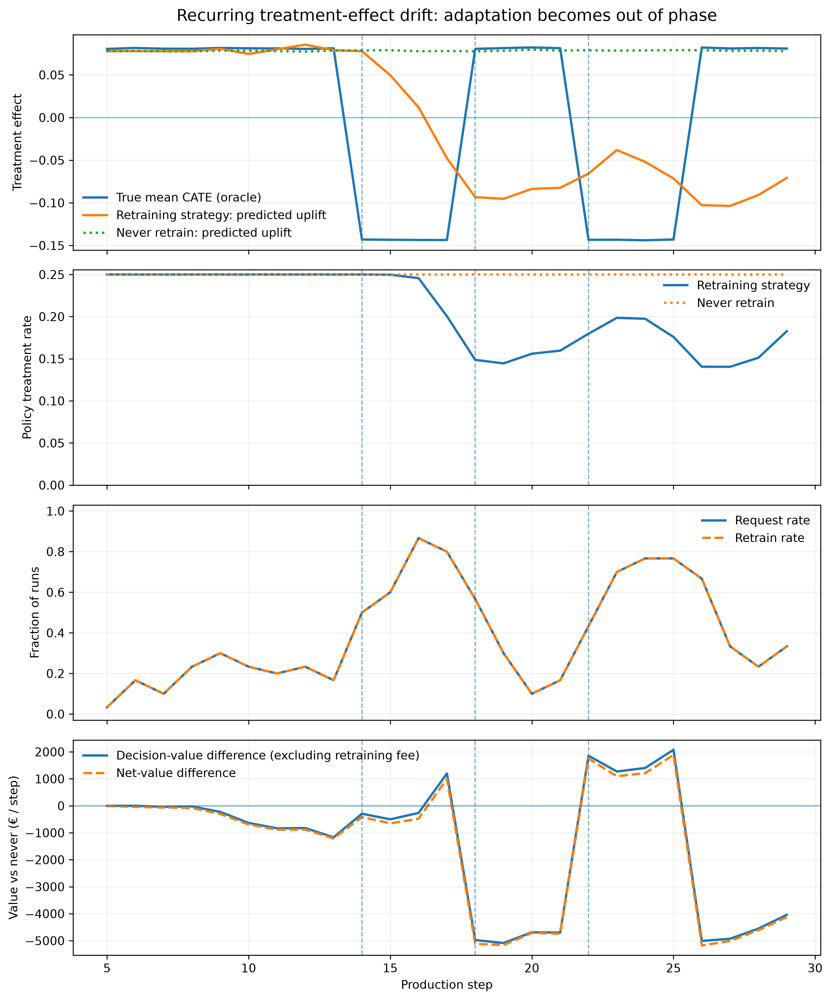

# CausalGuard


[](https://causalguard.streamlit.app/)


**Decision-aware monitoring and retraining for causal targeting policies under distribution shift.**

CausalGuard is a research-first **Causal ML + MLOps** project that asks a production question ordinary model monitoring does not answer:

> **When should a causal targeting policy be retrained if the real objective is preserving decision value rather than predictive accuracy?**

It compares feature-distribution, predictive-performance, treatment-effect, and policy-value retraining signals under controlled temporal shift, then evaluates whether acting on those signals actually improves the economics of the deployed treatment policy.

CausalGuard now combines two complementary evidence layers:

1. **Controlled simulation** — evaluates monitoring and retraining strategies under known temporal distribution shift.
2. **Randomized real data** — evaluates predictive-risk and causal uplift targeting on the Orange Belgium retention benchmark.

The simulation study addresses **when to retrain**. The Orange study addresses **how causal targeting compares with predictive targeting on randomized real-world data**.

---

## Live dashboard

Explore both the frozen simulation benchmark and the randomized Orange real-data study:

### [Launch CausalGuard Dashboard →](https://causalguard.streamlit.app/)

> The dashboard is read-only. It does not rerun experiments, retune thresholds, or retrain models.

---

## Main result

> **Detecting distribution shift is not equivalent to detecting a need to retrain.**

Retraining creates value when a persistent shift damages the causal decision rule, but can destroy value when the shift is decision-irrelevant or when adaptation lags a recurring environment.

Three mechanisms drive the main result:

- **Covariate drift:** the feature monitor detects the shift, but retraining reduces decision value even though the treatment rate remains unchanged.
- **Persistent treatment-effect drift:** causal retraining learns to suppress treatment after treatment effects become harmful and recovers substantial economic value.
- **Recurring treatment-effect drift:** the same adaptive behavior can become out of phase with the environment, so fast retraining can perform worse than leaving the policy stale.

---

## Benchmark at a glance

The final held-out benchmark is frozen and contains:

| Component | Final benchmark |
|---|---:|
| Drift regimes | 6 |
| Retraining strategies | 7 |
| Evaluation seeds | 30 (`1000-1029`) |
| Total runs | **1,260** |

### Drift regimes

1. No drift
2. Covariate drift
3. Outcome drift
4. Abrupt treatment-effect drift
5. Gradual treatment-effect drift
6. Recurring treatment-effect drift

### Retraining strategies

Primary benchmark strategies:

1. Never retrain
2. Periodic retraining
3. Feature-drift trigger
4. Predictive-performance trigger
5. CATE-shift trigger
6. Policy-value trigger

Secondary sensitivity analysis:

7. Confidence-aware policy-value trigger

The confidence-aware strategy uses a pilot-informed 80% confidence setting and is therefore reported as a **secondary sensitivity**, not as a primary pre-specified benchmark strategy.

---

## Selected findings

Mean net value varies strongly by drift regime, so the benchmark should not be interpreted as a universal trigger leaderboard.

| Regime | Comparison | Mean net-value difference |
|---|---|---:|
| No drift | Periodic vs never | **-€37.4k** |
| Covariate drift | Feature drift vs never | **-€30.3k** |
| Abrupt treatment drift | Policy value vs never | **+€51.8k** |
| Gradual treatment drift | Policy value vs never | **+€23.8k** |
| Recurring treatment drift | Policy value vs never | **-€37.4k** |

Paired bootstrap intervals, stationary-action behavior, response delays, and run-level summaries are available under:

```text
analysis/main_trigger_benchmark/
```

---

## Mechanism analysis

The final analysis separates direct retraining expense from downstream policy effects.

| Regime / strategy | Mean net Δ vs never | Direct retraining cost | Decision-value Δ vs never |
|---|---:|---:|---:|
| Covariate / feature drift | -€30,255 | €1,267 | -€28,988 |
| Treatment / policy value | +€51,825 | €3,200 | +€55,025 |
| Recurring treatment / policy value | -€37,432 | €2,450 | -€34,982 |

The main gains and losses are therefore driven mostly by **policy adaptation**, not by the nominal retraining fee itself.

### Recurring drift: adaptation can become out of phase



The learned policy adapts to one treatment-effect regime, but the environment can switch again before the model catches up.

The result is a **phase mismatch** between the current causal regime and the policy's learned treatment behavior.

Additional mechanism figures are available in:

```text
analysis/main_trigger_benchmark/figures/
```

---

## Randomized real-data study

CausalGuard also evaluates targeting policies on the Orange Belgium randomized retention benchmark.

| Component | Orange study |
|---|---:|
| Customers | 11,896 |
| Features | 178 |
| Treatment rate | 75.74% |
| Cross-fitting | 5 folds |
| Primary estimator | DR / AIPW |
| Primary targeting budget | 25% |

The pre-specified primary comparison is **predictive-risk targeting versus uplift targeting**.

At the 25% targeting budget:

| Comparison | DR difference per customer | 95% CI |
|---|---:|---:|
| Risk − Uplift | **+0.002637** | **[-0.001649, +0.006924]** |

The point estimate is positive, but the confidence interval includes zero. The final analysis therefore does **not provide clear evidence of a difference** between predictive-risk and uplift targeting at the primary budget.

### Cross-fit partition stability

Across 10 cross-fitting partitions of the same 11,896 customers:

- mean Risk − Uplift difference: **+0.003242**
- median difference: **+0.003183**
- range: **+0.000817 to +0.005311**
- positive point estimates: **10 / 10**
- partition-specific 95% CIs excluding zero: **2 / 10**

These partitions reuse the same customers and therefore measure **sensitivity to fold assignment**, not independent replication.

Orange does not provide the temporal structure needed to validate the drift/retraining mechanisms. Those claims remain controlled-simulation evidence.

---

## Dashboard

The Streamlit application has two top-level research tabs.

### Simulation Benchmark

Explore:

- mean net value and 95% confidence intervals
- retraining burden and paired comparisons
- stationary monitoring behavior
- post-drift response and response delay
- covariate, persistent-treatment, and recurring-treatment mechanisms

### Orange Real Data

Explore:

- randomized-retention dataset characteristics
- cross-fitted DR/AIPW policy values
- predictive-risk versus uplift targeting
- the pre-specified 25% primary comparison
- 10% and 50% budget sensitivities
- cross-fit partition stability

The Orange tab is intentionally separate from the temporal-drift benchmark. It evaluates real-data causal targeting, not real-world retraining under temporal drift.

Run the dashboard locally with:

```bash
pip install -e '.[dashboard]'
python -m streamlit run dashboard/app.py
```

Or use the hosted version:

**https://causalguard.streamlit.app/**

---

## Scientific design

CausalGuard separates three parts of the data-generating process:

- `P(X)`: customer characteristics
- baseline outcome behavior
- heterogeneous treatment effect `tau(X)`

This allows controlled shifts in which input distributions change without treatment value changing, as well as shifts in which treatment effects change while conventional monitoring signals remain comparatively stable.

The production simulation also maintains **persistent randomized exploration traffic**.

Causal monitoring and causal retraining use observations with known treatment propensities rather than silently treating policy-generated treatment assignments as randomized data.

### Economic objective

The primary target is cumulative incremental net value.

Treatment cost is included in per-customer incremental value, retraining cost is charged when a retraining event succeeds, and randomized exploration can reduce value endogenously because it overrides the policy action for part of the traffic.

CausalGuard therefore treats retraining as an **economic decision**, not an automatic reaction to detected shift.

---

## Oracle vs deployable signals

The simulator exposes privileged counterfactual quantities such as true CATE and oracle incremental value.

These are used **only for evaluation**.

They are never inputs to deployable monitoring or retraining triggers.

This distinction is central to the project:

> A monitor must act using signals that could plausibly exist in production, while the simulator can use oracle information afterward to evaluate whether those decisions were good.

---

## Frozen configuration

The final benchmark configuration is stored at:

```text
configs/experiments/trigger_benchmark_frozen.yaml
```

Key frozen settings:

```yaml
feature_drift_threshold: 0.04406
performance_threshold: 0.2296
cate_shift_threshold: 0.2326
policy_value_threshold: 0.0

monitor_window_steps: 3
policy_value_confidence_level: 0.80

retraining_data_strategy: rolling_window
retraining_window_steps: 5
retraining_cooldown_steps: 0
```

Thresholds were calibrated before the final evaluation seeds and were not retuned after the held-out benchmark.

---

## Repository layout

```text
causalguard/
├── analysis/
│   ├── main_trigger_benchmark/
│   │   ├── frozen aggregate results
│   │   ├── paired comparisons
│   │   ├── mechanism trajectories
│   │   └── publication figures
│   └── orange/
│       ├── data audit
│       ├── primary policy results
│       ├── primary paired results
│       └── partition-stability summaries
├── configs/
│   └── experiments/
│       ├── experiment definitions
│       └── frozen benchmark configuration
├── dashboard/
│   └── Streamlit results dashboard
├── data/
│   └── local/external data locations
├── experiments/
│   └── local raw experiment outputs
├── notebooks/
│   └── exploratory work only
├── reports/
│   └── paper/
│       ├── simulation protocol
│       ├── orange_protocol.md
│       ├── claims log
│       └── related-work notes
├── scripts/
│   ├── benchmark analysis
│   ├── mechanism analysis
│   └── figure generation
├── src/causalguard/
│   ├── data/
│   ├── models/
│   ├── policy/
│   ├── simulation/
│   ├── monitoring/
│   ├── retraining/
│   ├── evaluation/
│   └── pipelines/
└── tests/
```

Raw benchmark runs are intentionally kept out of the public release to avoid repository bloat.

The frozen aggregate outputs required by the dashboard and reported analysis are committed under:

```text
analysis/main_trigger_benchmark/
analysis/orange/
```

---

## Installation

Python 3.11 is recommended.

```bash
python -m venv .venv
source .venv/bin/activate

python -m pip install --upgrade pip
pip install -e '.[dev,dashboard]'
```

Conda works equally well. The project was developed and validated with Python 3.11.

---

## Run a single experiment

```bash
causalguard-run \
  --config configs/experiments/base.yaml \
  --output experiments/latest
```

Override individual settings:

```bash
causalguard-run \
  --config configs/experiments/base.yaml \
  --output experiments/covariate_periodic \
  --set drift_type=covariate \
  --set trigger=periodic
```

---

## Reproduce the frozen analysis

If the raw final benchmark outputs are available locally under:

```text
experiments/main_trigger_benchmark/
```

run:

```bash
python scripts/analyze_main_benchmark.py
python scripts/analyze_mechanisms.py
python scripts/plot_main_mechanisms.py
```

These commands regenerate the aggregate CSVs and mechanism figures under:

```text
analysis/main_trigger_benchmark/
```

---

## Tests and code quality

```bash
python -m ruff check .
python -m pytest -q
```

Current release state: **21 tests passing**.

GitHub Actions runs linting and the automated test suite on pushes and pull requests.

---

## Randomized real-data evidence

The Orange Belgium study is a completed secondary study within CausalGuard. It uses randomized treatment assignments, 5-fold cross-fitting, and a doubly robust DR/AIPW estimator to compare targeting policies out of sample.

The pre-specified primary 25% comparison estimated Risk − Uplift at **+0.002637 retained customers per customer** with a **95% CI of [-0.001649, +0.006924]**. The interval includes zero, so the result is reported as uncertain rather than as evidence that one targeting strategy universally dominates the other.

Across 10 alternative cross-fit partitions, the point estimate remained positive, but these partitions reuse the same customers and are treated as **algorithmic/fold stability**, not independent replication.

Orange does not provide oracle counterfactual treatment effects or a controlled temporal drift process. The monitoring and retraining claims therefore remain **controlled simulation evidence**.

---

## Research safeguards

The study follows several rules throughout:

- do not assume uplift targeting must outperform predictive targeting
- do not assume sophisticated retraining triggers must beat periodic or no retraining
- keep real-data evidence separate from simulator-oracle evidence
- never use simulator oracle quantities as deployable monitoring signals
- retain randomized exploration for causal monitoring and retraining
- report paired uncertainty rather than relying on mean rankings alone
- preserve simple baselines such as never and periodic retraining
- freeze thresholds before final evaluation seeds
- treat negative and null findings as scientifically useful
- avoid first-of-its-kind novelty claims without a systematic literature review

---

## Limitations and extensions

The current study intentionally uses transparent causal baselines and a controlled simulator.

Natural extensions include:

- sequentially valid causal monitoring / confidence sequences
- doubly robust and sequentially valid monitoring under temporal drift
- formal CATE change-point methods
- delayed-outcome modeling
- exploration-rate sensitivity
- broader cost and drift-strength sensitivity analysis
- stronger causal learners
- contextual-bandit adaptation
- larger real-data uncertainty studies

These are **extensions to the frozen benchmark**, not missing pieces required to interpret the reported main experiment.

---

## Related work and claims discipline

Working literature notes are in:

```text
reports/paper/related_work.md
```

The repository also maintains a claims log distinguishing simulation evidence, randomized real-data evidence, oracle quantities, and unsupported novelty claims:

```text
reports/paper/claims_log.md
```

---

## Status

The main CausalGuard research release is complete:

- frozen 1,260-run held-out simulation benchmark
- aggregate and paired uncertainty analysis
- mechanism analysis and figures
- randomized Orange real-data targeting study
- cross-fitted DR/AIPW policy evaluation
- fold-partition stability analysis
- automated tests
- two-tab interactive Streamlit dashboard
- public deployment

Future work is focused on research extensions, external validation, and communication rather than changes to the frozen benchmark.

---

_CausalGuard is a research prototype for studying decision-aware causal retraining under controlled distribution shift. It is not intended as a production decision system without additional validation, monitoring, and domain-specific safeguards._
